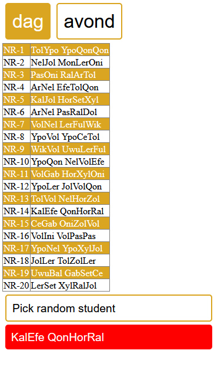

# Oefening

Werk verder op oefening_4 uit oefeningen_les_11. We gaan onze applicatie voorzien van een grafische UI + enkele interactie elementen. Maak hierbij gebruik van html, js en css.

## Stap 1
De 2 klassen in een html pagina laten zien.
* Print de 2 klassen op je scherm in een tabel.
* Maak 2 knoppen (mbv p tags) om tussen de 2 tabellen te kunnen switchen.
* Maak een knop (p tag) die er voor zorgt dat je een random student uit je tabel kan selecteren.

## Stap 2
Zelf klassen toevoegen

* Voorzie in html een knop (p tag) waarmee je zelf klassen kan toevoegen.
* Wanneer op de knop geklikt wordt, wordt er aan de hand van een prompt volgende zaken gevraagd
  * Klasgrootte
  * dag of avond klas
* Toon de klas op het scherm

